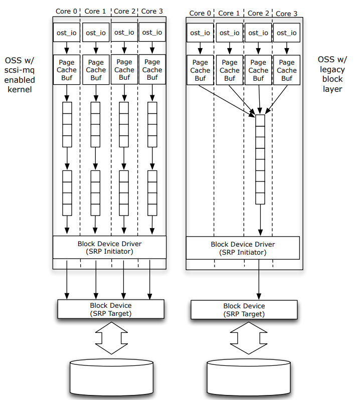

# Linux block device driver :floppy_disk:
### 简介
该项目用于在linux系统(:pushpin:内核版本>=5.3.0）中注册一个块设备。<br/>
这种类型的设备用于访问各种存储硬件类型如`硬盘`，`SSD`等。

## Linux中的单队列与多队列
最初Linux块设备是为带有旋转磁盘和移动磁头的HDD设计的。这样的硬件不能支持对不同磁盘扇区上不同数据块的并行访问。

早期的Linux内核提供了一些调度器，并且设备只支持一个读写请求队列。这是Linux内核块设备框架。<br/>
现代SSD设备支持快速随机访问，可以处理多个I/O请求。为此，内核支持一个新的框架——具有多个队列的block -mq。

```
sudo make
sudo insmod test_blockdev.ko
```
