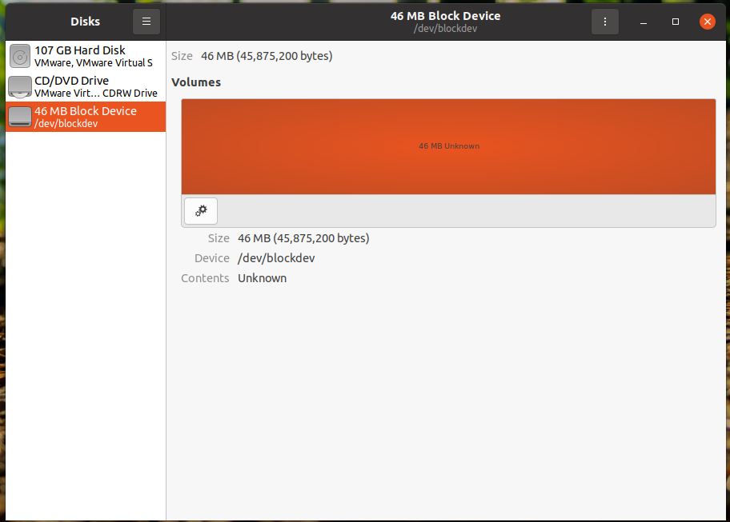

# Linux block device driver :floppy_disk:
### 简介
该项目用于在linux系统(:pushpin:内核版本>=5.3.0）中注册一个块设备。<br/>
这种类型的设备用于访问各种存储硬件类型如`硬盘`，`SSD`等。

## Linux中的单队列与多队列
最初Linux块设备是为带有旋转磁盘和移动磁头的HDD设计的。这样的硬件不能支持对不同磁盘扇区上不同数据块的并行访问。

早期的Linux内核提供了一些调度器，但设备只支持一个读写请求队列。<br/>
现代SSD设备支持快速随机访问，可以处理多个I/O请求。为此，Linux内核支持一个新的框架——具有多个队列的blk-mq。
<br/>
<a > 
    
</a>
<br/>
多队列框架是在Linux内核版本`4.x`中引入的。但是由于5.0版本blk-mq是默认的，并且旧的框架被删除了。所有的基于`single-queue`驱动程序都应该重写。

本项目主要为解决在Linux系统中注册SSD设备，因此下面提供一些例子。
## 基本数据结构
**struct gendisk**<br/>
gendisk结构是块子系统的核心，在Linux内核2.4中引入。<br/>
该结构表示一个磁盘设备，并保存所有必要的信息，如设备名称、队列、用户和系统数据。

下面是Linux-5.4.0中的gendisk结构体源代码。
```cpp
struct gendisk {
	/* major、first_minor 和 minors 仅为输入参数，不要直接使用。
	 * 使用 disk_devt() 和 disk_max_parts()。
	 */
	int major;                        /* 驱动程序的主要号 */
	int first_minor;
	int minors;                      /* 最大次设备号数量，对于不能分区的磁盘 =1。 */

	char disk_name[DISK_NAME_LEN];    /* 主要驱动程序的名称 */
	char *(*devnode)(struct gendisk *gd, umode_t *mode);

	unsigned short events;           /* 支持的事件 */
	unsigned short event_flags;      /* 与事件处理相关的标志 */

	/* 指向分区的指针数组，由 partno 索引。
	 * 使用匹配的 bdev 锁保护，但 stat 和其他非关键访问使用 RCU。
	 * 始终通过帮助程序进行访问。
	 */
	struct disk_part_tbl __rcu *part_tbl;
	struct hd_struct part0;

	const struct block_device_operations *fops;
	struct request_queue *queue;
	void *private_data;

	int flags;
	struct rw_semaphore lookup_sem;
	struct kobject *slave_dir;

	struct timer_rand_state *random;
	atomic_t sync_io;                /* RAID */
	struct disk_events *ev;
#ifdef  CONFIG_BLK_DEV_INTEGRITY
	struct kobject integrity_kobj;
#endif  /* CONFIG_BLK_DEV_INTEGRITY */
	int node_id;
	struct badblocks *bb;
	struct lockdep_map lockdep_map;
};
```


内核中提供了用于`分配`、`释放`gendisk和`添加`、`删除`磁盘的函数集，如下所示：

```cpp
struct gendisk *alloc_disk(int minors) 

void add_disk(struct gendisk *disk) 

void set_capacity(struct gendisk *disk, sector_t size)  

void del_gendisk(struct gendisk *gp) 

void put_disk(struct gendisk *disk) 
```

gendisk结构的典型初始化例程是设置`磁盘名称`、设置`标志`、初始化`I/O队列`和设置`驱动程序私有数据`。

注册设备函数：

```cpp
int register_blkdev(unsigned int major, const char * name)
```

对gendisk操作需要编写特定的操作函数，例如`open`,`close`和`ioctl`操作。

```cpp
#include <linux/fs.h>

int blockdev_open(struct block_device *dev, fmode_t mode)
{
    printk("Device %s opened"\n, dev->bd_disk->disk_name);
    return 0;
}

void blockdev_release(struct gendisk *gdisk, fmode_t mode)
{
    printk("Device %s closed"\n, dev->bd_disk->disk_name);
}

int blockdev_ioctl (struct block_device *dev, fmode_t mode, unsigned cmd, unsigned long arg)
{
    return -ENOTTY; /* ioctl not supported */
}

static struct block_device_operations blockdev_ops = {
    .owner = THIS_MODULE,
    .open = blockdev_open,
    .release = blockdev_release,
    .ioctl = blockdev_ioctl
};
```

初始化队列

```cpp
struct request_queue *blk_mq_init_sq_queue(struct blk_mq_tag_set *set,
                        const struct blk_mq_ops *ops,
                        unsigned int queue_depth,
                        unsigned int set_flags);
```

其他函数不再赘述，block_dev.c是一个完整的注册块设备的例子，可通过修改其中的capacity设置自己想要的块设备大小。<br/>
其中capacity是块设备大小，可以随意设置。当前 `(11200 * PAGE_SIZE) >> 9`的大小约为`44.8MB`。若要其他大小可对capacity进行修改。<br/>
:no_entry_sign::bell:block_device->data是申请的buffer大小，该buffer的大小不可过大，否则会出现`"Cannot allocate memory"`的错误，最好不要对其进行修改。

```cpp
 /* Set some random capacity of the device */
    block_device->capacity = (11200 * PAGE_SIZE) >> 9; /* nsectors * SECTOR_SIZE; */
    /* Allocate corresponding data buffer */
    block_device->data = kmalloc(112 * PAGE_SIZE, GFP_KERNEL);
```

### 测试代码:white_check_mark:
首先对代码进行编译，然后加载模块`test_block.ko`。
```
sudo make
sudo insmod test_blockdev.ko
```

然后对其进行操作：

```
$ sudo fdisk /dev/blockdev

Welcome to fdisk (util-linux 2.34).
Changes will remain in memory only, until you decide to write them.
Be careful before using the write command.

Device does not contain a recognized partition table.
Created a new DOS disklabel with disk identifier 0xe2a63838.

Command (m for help): o
Created a new DOS disklabel with disk identifier 0xd1e7f113.

Command (m for help): w 
The partition table has been altered.
Syncing disks.

$ sudo fdisk /dev/blockdev

Welcome to fdisk (util-linux 2.34).
Changes will remain in memory only, until you decide to write them.
Be careful before using the write command.


Command (m for help): p
Disk /dev/blockdev: 43.77 MiB, 45875200 bytes, 89600 sectors
Units: sectors of 1 * 512 = 512 bytes
Sector size (logical/physical): 512 bytes / 512 bytes
I/O size (minimum/optimal): 512 bytes / 512 bytes
Disklabel type: dos
Disk identifier: 0xd1e7f113
```

:smile:如你所见，fdisk将我们的块设备识别为有效的磁盘，并成功地创建了一个id为0xd1e7f113的新的DOS分区表。

:smile:这个分区表存储在驱动程序的内存缓冲区中，在卸载驱动程序之前一直有效。

利用可视化工具也可以看到磁盘中多了一个大小为46MB的块设备：
<br/>
<a > 
    
</a>
<br/>

